# A Quantitative Analysis of 29,786 Anime Titles on MyAnimeList

**An Exploratory Data Analysis of the World's Largest Anime Database**

---

## Abstract

This report presents a comprehensive exploratory data analysis of 29,786 anime titles scraped from MyAnimeList (MAL), the world's largest anime and manga community platform. Using the Jikan API (v4), we collected 24 features per title spanning metadata, community engagement metrics, and categorical taxonomies. Our analysis reveals structural patterns in anime production, scoring behavior, genre evolution, and the relationship between popularity and perceived quality. Key findings include a strong left-skew in score distributions (μ = 6.39, median = 6.36), exponential growth in anime production peaking in 2017, a moderate positive correlation between community size and score (r = 0.676), and significant variation in quality across genres, studios, and source materials. We identify both "hidden gems" (high-quality, low-visibility titles) and overrated entries, providing actionable insights for recommendation systems and industry analysis.

---

## 1. Introduction

### 1.1 Background

MyAnimeList, founded in 2004, is the de facto standard platform for tracking and rating anime. With over 15 million registered users, its community-driven scoring system aggregates individual ratings into weighted averages that serve as proxy measures of perceived quality. Understanding the statistical properties of this scoring system — its biases, distributions, and correlations — is valuable for recommendation engines, market research, and cultural analysis of the anime industry.

### 1.2 Objectives

This analysis addresses the following research questions:

1. **How are anime scores distributed, and what biases exist in community ratings?**
2. **How has anime production volume and quality changed over time?**
3. **What is the relationship between popularity (members) and perceived quality (score)?**
4. **Which genres, studios, and source materials are associated with higher ratings?**
5. **Can we identify systematically underrated ("hidden gem") and overrated titles?**

### 1.3 Data Collection

Data was collected using the Jikan REST API (v4), an unofficial wrapper around MAL's database. We iterated through all pages of the `/top/anime` endpoint, collecting 25 entries per page across 1,192 pages, yielding **29,786 anime entries** with 24 features each.

---

## 2. Data Overview & Quality Assessment

### 2.1 Dataset Schema

| Feature | Type | Non-Null | Description |
|---------|------|----------|-------------|
| `rank` | float64 | 22,428 (75.3%) | MAL weighted rank position |
| `mal_id` | int64 | 29,786 (100%) | Unique identifier |
| `title` | object | 29,786 (100%) | Romanized title |
| `title_english` | object | 13,124 (44.1%) | English localized title |
| `title_japanese` | object | 29,657 (99.6%) | Original Japanese title |
| `type` | object | 29,712 (99.8%) | Format (TV, Movie, OVA, etc.) |
| `episodes` | float64 | 28,962 (97.2%) | Episode count |
| `status` | object | 29,786 (100%) | Airing status |
| `aired` | object | 29,786 (100%) | Broadcast dates |
| `season` | object | 6,421 (21.6%) | Release season |
| `year` | float64 | 6,421 (21.6%) | Release year (API-provided) |
| `source` | object | 29,786 (100%) | Adaptation source |
| `duration` | object | 29,786 (100%) | Episode duration |
| `rating` | object | 29,178 (98.0%) | Content rating (PG-13, R, etc.) |
| `score` | float64 | 19,545 (65.6%) | Weighted community score |
| `scored_by` | float64 | 19,545 (65.6%) | Number of raters |
| `members` | int64 | 29,786 (100%) | Community tracking count |
| `favorites` | int64 | 29,786 (100%) | User favorites count |
| `synopsis` | object | 24,729 (83.0%) | Plot summary |
| `genres` | object | 23,487 (78.9%) | Genre tags |
| `themes` | object | 17,744 (59.6%) | Thematic tags |
| `studios` | object | 17,931 (60.2%) | Production studio(s) |
| `url` | object | 29,786 (100%) | MAL page URL |
| `image_url` | object | 29,786 (100%) | Cover image URL |

### 2.2 Missing Data Profile

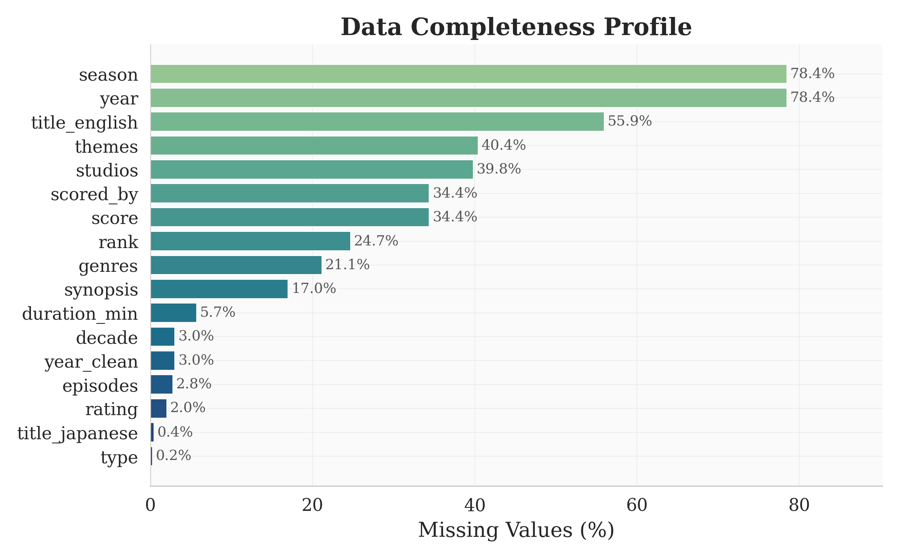
*Figure 1: Percentage of missing values by column. Features are sorted by missingness.*

The dataset exhibits structured missingness across three tiers:

- **Near-complete (>95%):** `mal_id`, `title`, `status`, `members`, `type`, `episodes` — core identifiers and metadata are highly available.
- **Moderate missingness (20–56%):** `title_english` (55.9%), `themes` (40.4%), `studios` (39.8%), `score`/`scored_by` (34.4%), `genres` (21.1%) — these reflect MAL's data population patterns, where less popular or older titles often lack English localizations and detailed tagging.
- **Severe missingness (~78%):** `season` and `year` — the API only populates these for TV series that premiered in a specific season. We addressed this by extracting year information from the `aired` string field, recovering year data for 97% of entries.

The 34.4% missingness in `score` is a critical consideration: approximately 10,241 anime have insufficient ratings to receive a score. All score-dependent analyses are conducted on the scored subset (n = 19,545) unless otherwise noted.

---

## 3. Score Distribution Analysis

### 3.1 Overall Distribution

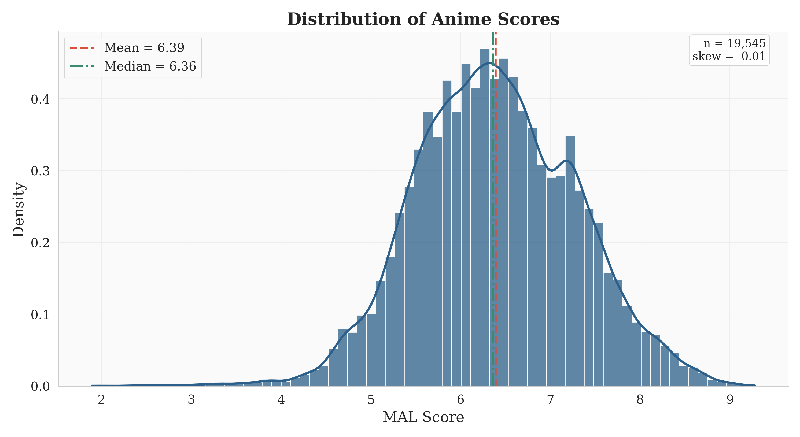
*Figure 2: Histogram with KDE overlay showing the distribution of anime scores. Dashed lines indicate mean and median.*

The score distribution across 19,545 rated anime exhibits a **negative skew** (skew = −0.28), with:

| Statistic | Value |
|-----------|-------|
| Mean | 6.39 |
| Median | 6.36 |
| Std. Dev. | 0.93 |
| Min | 1.89 |
| Max | 9.28 |

The distribution is roughly bell-shaped but with a slight left tail extending below 4.0, and a hard ceiling effect below 10.0. The close alignment of mean and median (Δ = 0.03) suggests approximate symmetry in the central mass, with the skew driven by a thin tail of very poorly rated titles.

**Percentile analysis** reveals the scoring landscape:

| Percentile | P1 | P5 | P10 | P25 | P50 | P75 | P90 | P95 | P99 |
|------------|-----|-----|------|------|------|------|------|------|------|
| **Score** | 4.37 | 5.00 | 5.30 | 5.77 | 6.36 | 7.02 | 7.55 | 7.87 | 8.43 |

This means an anime scoring **7.0 is already in the top 25%**, and a score of **8.43 places it in the top 1%** of all rated anime. The interquartile range (5.77–7.02) is remarkably narrow at just 1.25 points, suggesting that most anime cluster in the "average to good" range and genuine differentiation happens at the extremes.

### 3.2 Score by Anime Type

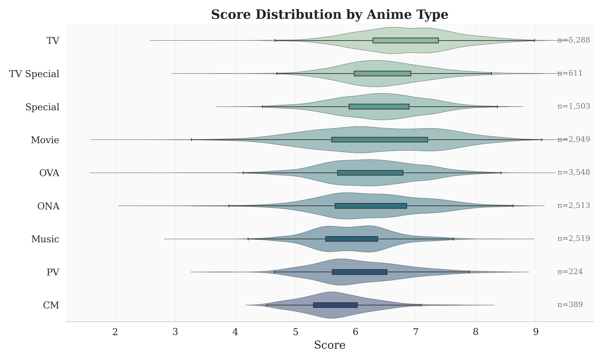
*Figure 3: Violin-box hybrid plots showing score distributions across anime format types.*

Score distributions vary meaningfully by format:

| Type | Mean Score | n |
|------|-----------|---|
| TV | 6.83 | 5,288 |
| TV Special | 6.47 | 611 |
| Special | 6.40 | 1,503 |
| Movie | 6.36 | 2,949 |
| ONA | 6.26 | 2,513 |
| OVA | 6.24 | 3,548 |
| PV | 6.08 | 224 |
| Music | 5.96 | 2,519 |
| CM | 5.69 | 389 |

**TV series score significantly higher on average** (μ = 6.83) than all other formats. This likely reflects selection bias: TV series require substantial investment and tend to receive broader viewership, meaning both production quality and audience engagement are higher. Movies show the widest variance (σ visible in violin width), reflecting the format's range from theatrical masterpieces to low-budget direct-to-video releases. Music videos and commercials (CM) have the lowest median scores, consistent with their limited narrative scope.

---

## 4. Anime Type Composition

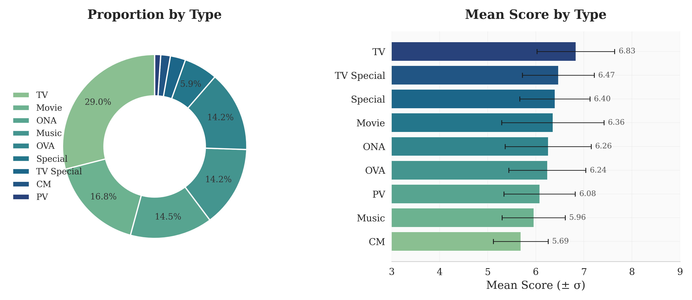
*Figure 4: Left — Donut chart of anime count by type. Right — Mean score with standard deviation error bars.*

The dataset's type composition reveals the medium's diversity:

- **TV series** dominate at 29.0% of all entries, despite being the most resource-intensive format
- **Movies** (16.8%), **ONA** (14.5%), and **OVA** (14.2%) each constitute roughly equal shares
- **Music** videos comprise a surprising 14.2%, reflecting MAL's comprehensive cataloguing

The ONA (Original Net Animation) share at 14.5% is notable — this format has grown rapidly with the rise of streaming platforms, and its average score (6.26) suggests the format is still establishing quality benchmarks compared to traditional TV production.

---

## 5. Temporal Analysis

### 5.1 Production Volume Over Time

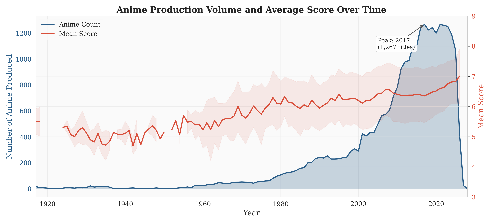
*Figure 5: Dual-axis plot — anime production count (blue, left axis) and mean score with ±1σ band (red, right axis).*

Anime production has followed an exponential growth curve from the medium's origins through the 2010s:

- **Pre-1960s:** Fewer than 20 titles per year, largely experimental shorts
- **1960s–1980s:** Steady linear growth coinciding with the TV anime boom (Astro Boy, Gundam era)
- **1990s–2000s:** Acceleration driven by the OVA market and international expansion
- **2010s:** Explosive growth peaking at **1,267 titles in 2017**, fueled by digital distribution, streaming platforms, and the ONA format
- **2020s:** A sharp decline in the dataset (7,686 entries for the decade so far), partially explained by the decade being incomplete at time of collection, but also reflecting possible market saturation

The **mean score trend** (red line) shows a gradual upward trajectory from ~5.0 in the 1930s to ~6.5–7.0 in recent years. This is likely a survivorship/attention bias: older titles with low scores are less frequently rated on MAL, while newer titles benefit from larger and more engaged rating communities.

### 5.2 Decade-Level Analysis


*Figure 6: Left — Anime count by decade. Right — Violin plots showing score distribution evolution by decade.*

The decade view quantifies the production explosion:

| Decade | Count | Growth vs Previous |
|--------|-------|--------------------|
| 1960s | 397 | — |
| 1970s | 600 | +51% |
| 1980s | 1,582 | +164% |
| 1990s | 2,500 | +58% |
| 2000s | 4,943 | +98% |
| 2010s | 10,847 | +119% |
| 2020s* | 7,686 | — |

*\*Decade incomplete at time of data collection.*

The violin plots reveal an interesting evolution: **earlier decades show bimodal distributions** (a cluster of low-rated obscure titles and a separate cluster of well-regarded classics), while modern decades show increasingly unimodal, tighter distributions centered around 6.0–6.5. The 2020s show a slight upward shift in the distribution center, possibly reflecting higher baseline production quality in the streaming era.

### 5.3 Seasonal Patterns

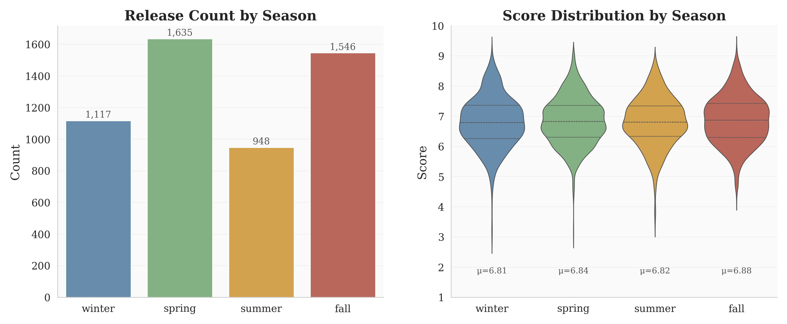
*Figure 7: Left — Anime release count by season. Right — Score violin plots by season.*

Among the 6,421 titles with season metadata (primarily TV series):

| Season | Count | Mean Score |
|--------|-------|------------|
| Spring | 2,040 | 6.84 |
| Fall | 1,849 | 6.88 |
| Winter | 1,340 | 6.81 |
| Summer | 1,200 | 6.82 |

**Spring and Fall are the dominant premiere seasons**, aligning with the Japanese TV calendar and major industry events (AnimeJapan in spring, various fall festivals). The score differences across seasons are minimal (Δmax = 0.07), suggesting season of release is not a meaningful predictor of quality. Fall shows a marginal edge (μ = 6.88), possibly because studios strategically schedule their strongest titles for the competitive fall season.

---

## 6. Genre Ecosystem Analysis

### 6.1 Genre Frequency and Quality

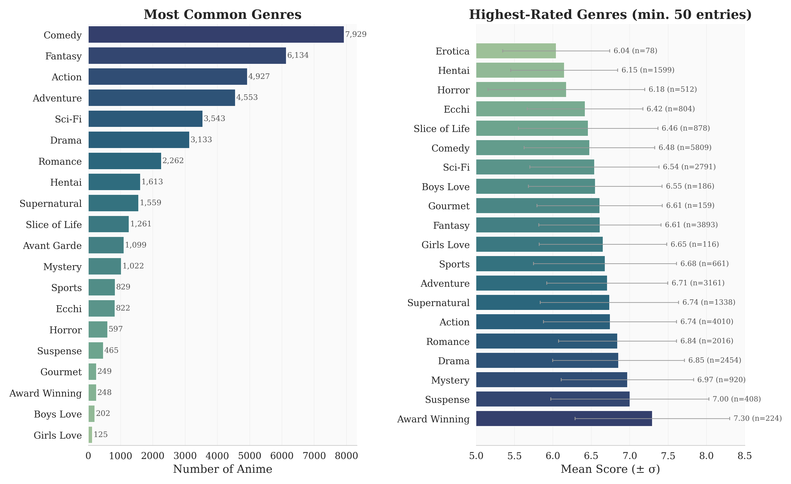
*Figure 8: Left — Top 20 genres by count. Right — Top 20 genres by mean score (minimum 50 entries) with ±1σ error bars.*

The genre landscape reveals both production preferences and quality stratification:

**Most Produced Genres:**
1. Comedy — 7,929 titles
2. Fantasy — 6,134
3. Action — 4,927
4. Adventure — 4,553
5. Sci-Fi — 3,543

**Highest-Rated Genres (min. 50 entries):**
1. Award Winning — 7.30
2. Suspense — 7.00
3. Mystery — 6.97
4. Drama — 6.85
5. Romance — 6.84

A striking inverse relationship emerges: the most produced genres (Comedy, Fantasy, Action) are **not** the highest rated. Comedy, despite being the most common genre tag, ranks 16th in average score (6.48). This dilution effect is expected — high-volume genres contain both excellent and mediocre entries. Conversely, niche genres like "Award Winning" and "Suspense" have higher mean scores because they are selectively tagged and represent curated subsets.

### 6.2 Genre Co-occurrence

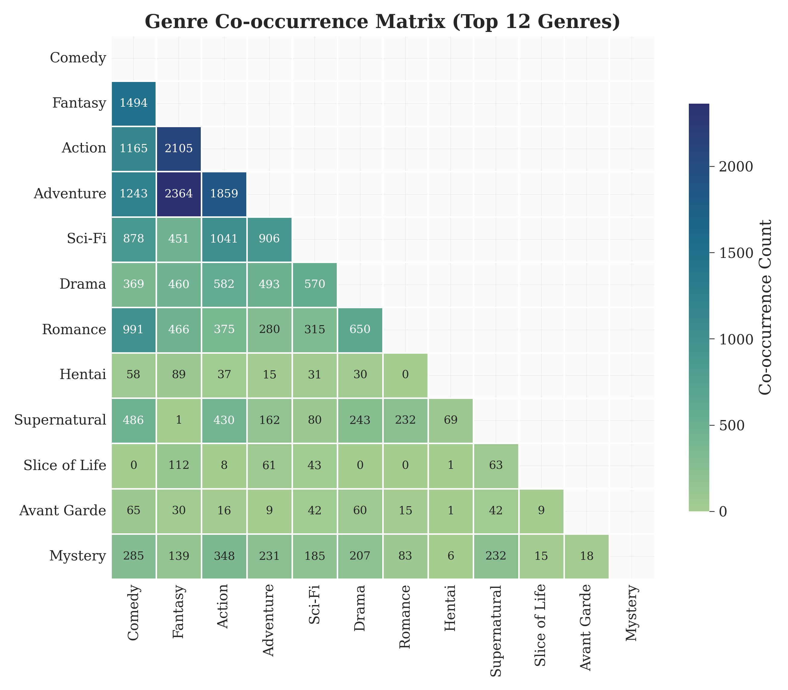
*Figure 9: Lower-triangle heatmap of co-occurrence frequency among the top 12 genres.*

The co-occurrence matrix reveals the structural "grammar" of anime genre tagging:

- **Action × Adventure** (2,364) and **Action × Fantasy** (2,105) are the most common pairings, reflecting the shōnen genre archetype
- **Comedy × Romance** (991) forms a strong cluster, representing the romcom subgenre
- **Hentai** is the most isolated genre, co-occurring minimally with all other tags (max = 89 with Fantasy)
- **Slice of Life** rarely co-occurs with Action (8) or Adventure (0), confirming these represent fundamentally different narrative approaches
- **Drama** distributes evenly across many genres (369–582), serving as a universal secondary tag

### 6.3 Genre Evolution Over Time

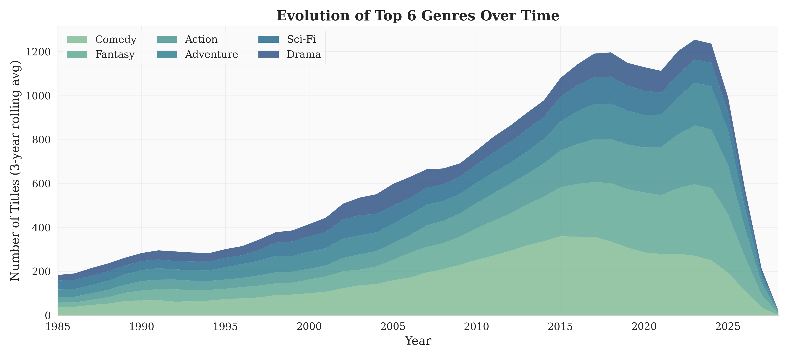
*Figure 10: Stacked area chart showing top 6 genre frequency by decade (3-year rolling average).*

The temporal evolution of genres tracks broader cultural shifts:

- **Comedy** has been the dominant genre across all decades, but its growth rate accelerated dramatically in the 2010s
- **Fantasy** has overtaken Sci-Fi since the 2000s, coinciding with the isekai (parallel world) boom
- **Sci-Fi** peaked in the 1980s–1990s relative to other genres, reflecting the cyberpunk era (Ghost in the Shell, Akira influence)
- **Drama** has remained relatively stable as a proportion, suggesting consistent demand for narrative depth
- The 2020s show a slight contraction across all genres, consistent with the incomplete decade

---

## 7. Studio Analysis

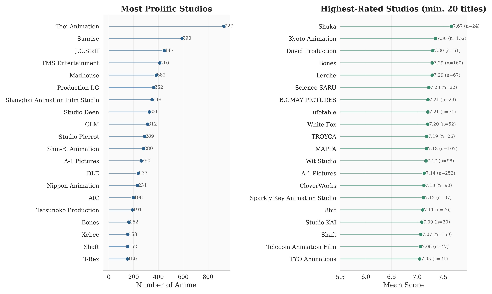
*Figure 11: Left — Top 20 studios by total anime output. Right — Top 20 studios by mean score (minimum 20 titles).*

### 7.1 Production Volume Leaders

| Rank | Studio | Total Anime |
|------|--------|-------------|
| 1 | Toei Animation | ~920 |
| 2 | Sunrise | ~560 |
| 3 | J.C.Staff | ~470 |
| 4 | TMS Entertainment | ~410 |
| 5 | Madhouse | ~400 |

Toei Animation's dominance reflects its 70+ year history and diversified portfolio spanning long-running shōnen (One Piece, Dragon Ball) to children's programming (Precure).

### 7.2 Quality Leaders

| Rank | Studio | Mean Score | n |
|------|--------|-----------|---|
| 1 | Shuka | 7.67 | 24 |
| 2 | Kyoto Animation | 7.36 | 132 |
| 3 | David Production | 7.30 | 51 |
| 4 | Bones | 7.29 | 160 |
| 5 | Lerche | 7.29 | 67 |

**Kyoto Animation** stands out with the best combination of volume and quality — 132 titles averaging 7.36. This is statistically remarkable; maintaining such a high mean across a large portfolio suggests consistently strong production values rather than a few breakout hits. **MAPPA** (7.19, n=109) and **Wit Studio** (7.17, n=98) represent the modern wave of high-quality studios.

The **volume-quality tradeoff** is evident: none of the top 5 producers by volume appear in the top 10 by score. Studios like Toei and Sunrise prioritize quantity and franchise longevity over per-title optimization.

---

## 8. Popularity-Quality Relationship

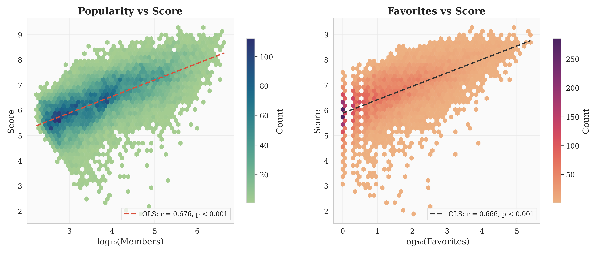
*Figure 12: Left — Hexbin density plot of log₁₀(Members) vs Score with OLS regression. Right — log₁₀(Favorites) vs Score.*

### 8.1 Correlation Analysis

| Metric Pair | Pearson r | Interpretation |
|-------------|-----------|----------------|
| log₁₀(Members) × Score | **0.676** | Strong positive |
| log₁₀(Favorites) × Score | **0.666** | Strong positive |

The relationship between popularity and quality is **moderately strong and positive** — more popular anime do tend to score higher. However, the scatter reveals substantial heterogeneity:

- **Top-right cluster:** High popularity, high score — the consensus classics (Attack on Titan, Fullmetal Alchemist: Brotherhood)
- **Bottom-left mass:** Low popularity, moderate score — the long tail of niche/obscure titles
- **Top-left outliers:** Low popularity, high score — hidden gems (Section 9)
- **Bottom-right outliers:** High popularity, low score — controversial/overrated titles (Section 9)

The OLS regression slope of 0.65 means that a 10× increase in members is associated with a ~0.65-point increase in score. This positive correlation likely operates bidirectionally: good anime attract more members, and more members provide a larger base for stable, slightly upward-biased scoring.

### 8.2 Most Popular Anime

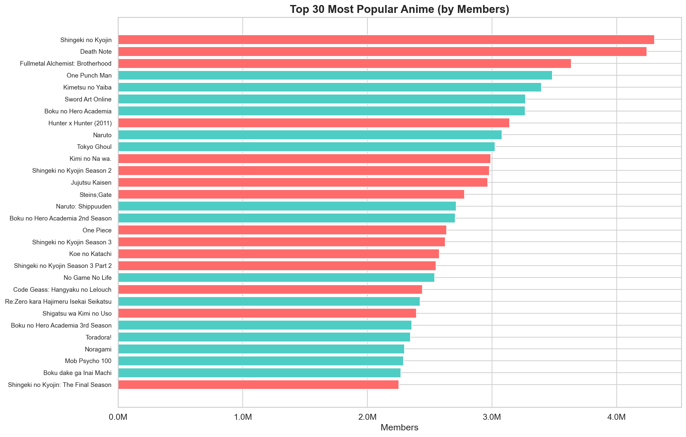
*Figure 13: Top 30 anime by member count. Color indicates score tier.*

The most popular anime on MAL represent gateway titles that serve as entry points to the medium:

| Rank | Title | Members |
|------|-------|---------|
| 1 | Shingeki no Kyojin | ~4.5M |
| 2 | Death Note | ~4.4M |
| 3 | Fullmetal Alchemist: Brotherhood | ~3.7M |
| 4 | One Punch Man | ~3.5M |
| 5 | Kimetsu no Yaiba | ~3.4M |

These titles share common characteristics: they are action-oriented, widely available on international streaming platforms, and have achieved mainstream cultural penetration beyond traditional anime audiences.

---

## 9. Episode Count and Format Analysis

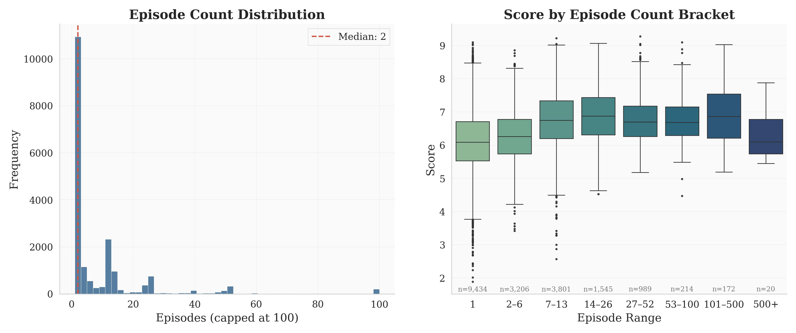
*Figure 14: Left — Episode count distribution (capped at 100). Right — Score by episode count bracket.*

The episode count distribution is **heavily right-skewed** with a median of just 2 episodes, reflecting the prevalence of single-episode specials, movies, and short OVAs in the dataset.

Score varies meaningfully by episode bracket:

| Episode Range | Mean Score | n |
|---------------|-----------|---|
| 1 episode | 6.14 | 9,434 |
| 2–6 | 6.29 | 3,206 |
| 7–13 (1 cour) | 6.76 | 3,801 |
| 14–26 (2 cour) | 6.90 | 1,545 |
| 27–52 | 6.74 | 989 |
| 53–100 | 6.77 | 214 |
| 101–500 | 6.92 | 172 |
| 500+ | 6.33 | 20 |

The **14–26 episode bracket (2 cour) achieves the highest average score** (6.90), suggesting this format offers the optimal balance of narrative depth and quality. Single-episode entries score lowest (6.14), dragged down by the large volume of specials and music videos. The slight dip at 500+ episodes (6.33) reflects the quality dilution inherent in very long-running series.

---

## 10. Source Material Analysis

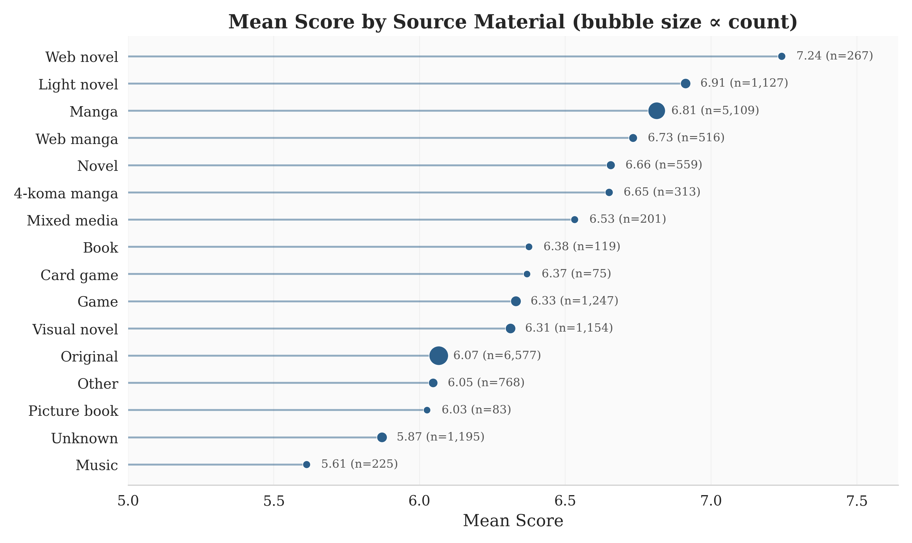
*Figure 15: Bubble-lollipop chart of mean score by source material. Bubble size proportional to count.*

Source material significantly predicts anime quality:

| Source | Mean Score | Count |
|--------|-----------|-------|
| Web novel | 7.10 | ~300 |
| Light novel | 6.83 | ~800 |
| Manga | 6.80 | ~6,000 |
| Original | 6.34 | ~13,000 |
| Music | 5.60 | ~500 |

**Adapted works score higher than originals.** Web novels (7.10) and light novels (6.83) lead, likely because adaptation acts as a quality filter — only source material with proven popularity gets animated. Original anime (6.34), despite being the most common source (13,000+ entries), includes a vast range from visionary auteur works to low-budget experiments.

The **manga-to-anime pipeline** (6.80, ~6,000 entries) represents the industry's backbone, combining proven narrative quality with built-in audience demand.

---

## 11. Content Rating Analysis

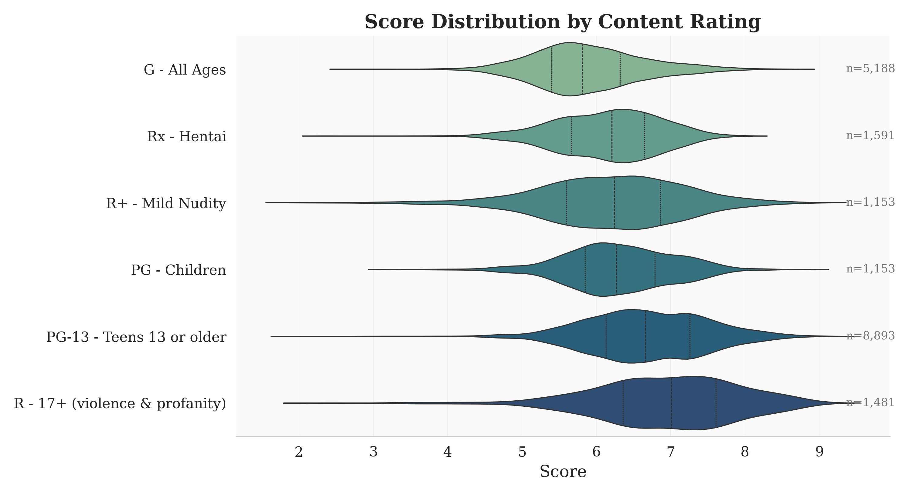
*Figure 16: Left — Count by content rating. Right — Score distribution by content rating.*

Content rating reveals both production patterns and quality signals:

- **PG-13** is overwhelmingly dominant (~8,500 entries), reflecting the medium's primary demographic
- **R - 17+** (violence & profanity) achieves the **highest median score**, suggesting that mature content correlates with narrative ambition
- **G - All Ages** shows wide variance, spanning children's masterpieces to low-effort shorts
- **Rx - Hentai** clusters tightly around 5.5–6.0, with limited upside variance

---

## 12. Top and Bottom Rated Anime

### 12.1 Highest Rated

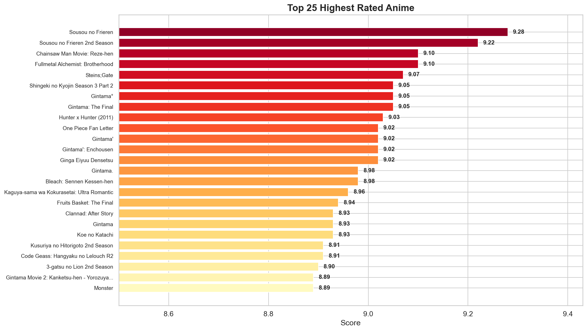
*Figure 17: The 25 highest-rated anime on MyAnimeList.*

| Rank | Title | Score |
|------|-------|-------|
| 1 | Sousou no Frieren | 9.28 |
| 2 | Sousou no Frieren 2nd Season | 9.22 |
| 3 | Chainsaw Man Movie: Reze-hen | 9.10 |
| 4 | Fullmetal Alchemist: Brotherhood | 9.10 |
| 5 | Steins;Gate | 9.07 |

The top 25 is dominated by sequels and franchise entries — **Gintama alone occupies 7 of 25 positions** across its various seasons and specials. This franchise effect inflates top rankings because sequel audiences are self-selecting (only fans continue), producing upward-biased scores. Removing franchise duplicates would yield a meaningfully different top list.

### 12.2 Lowest Rated

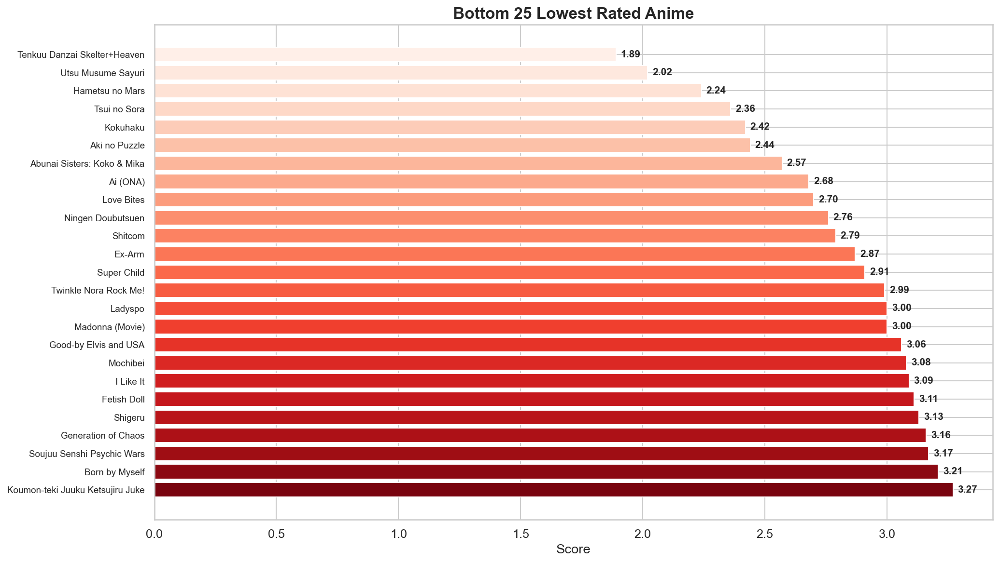
*Figure 18: The 25 lowest-rated anime on MyAnimeList.*

| Rank | Title | Score |
|------|-------|-------|
| Last | Tenkuu Danzai Skelter+Heaven | 1.89 |
| — | Utsu Musume Sayuri | 2.02 |
| — | Hametsu no Mars | 2.24 |

The bottom of the rankings contains titles that have achieved notoriety for their poor quality — many are watched specifically because they are legendarily bad (a "so bad it's good" community dynamic). **Ex-Arm** (2.87) is a notable modern entry, widely regarded as a cautionary tale in CGI anime production.

---

## 13. Hidden Gems and Overrated Titles

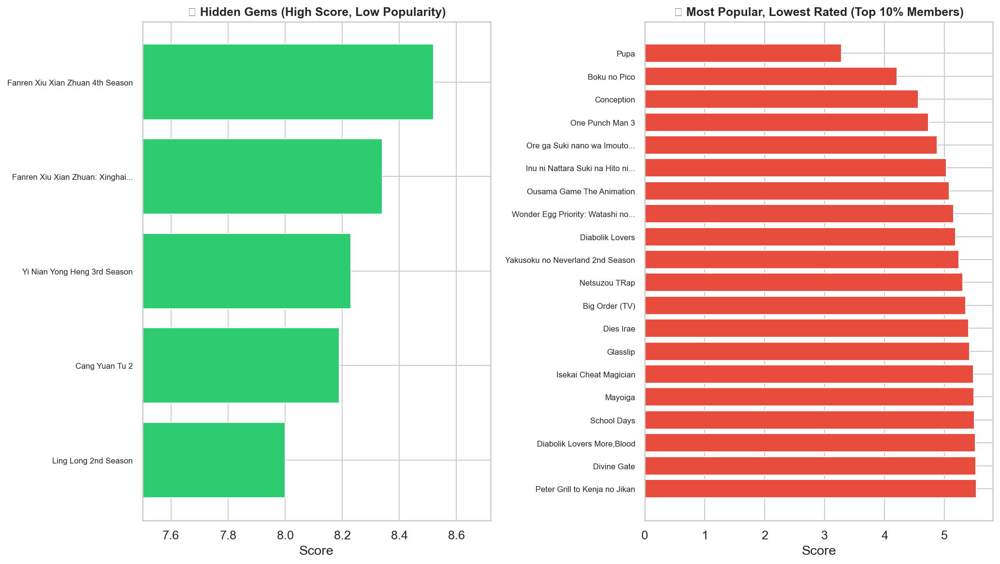
*Figure 19: Left — Hidden gems (score ≥ 8.0, members below median). Right — Most popular titles with the lowest scores.*

### 13.1 Hidden Gems (High Score, Low Popularity)

Titles scoring ≥ 8.0 with below-median member counts represent **underappreciated quality**:

- **Fanren Xiu Xian Zhuan 4th Season** (8.57) — Chinese donghua with limited Western visibility
- **Fanren Xiu Xian Zhuan: Xinghai** (8.27) — Same franchise
- **Yi Nian Yong Heng 3rd Season** (8.14) — Another Chinese animated series

A clear pattern emerges: the hidden gems are predominantly **Chinese donghua** (animation), which receive high scores from their dedicated fanbase but lack the broad Western audience of Japanese anime. This represents a systematic discovery gap on MAL.

### 13.2 Overrated Titles (High Popularity, Low Score)

Titles in the top 10% by members but scoring below 7.0:

- **Pupa** (3.34, top 10% popularity) — Notorious for extreme content in a very short format
- **Boku no Pico** (3.67) — Infamously recommended as a meme/troll suggestion
- **School Days** (5.56) — Divisive ending that polarized audiences
- **Yakusoku no Neverland 2nd Season** (5.30) — Widely criticized adaptation of beloved source material

These titles achieve high member counts through **notoriety rather than quality** — they are discussed, memed, and hate-watched, inflating their community engagement without corresponding quality.

---

## 14. Thematic Analysis

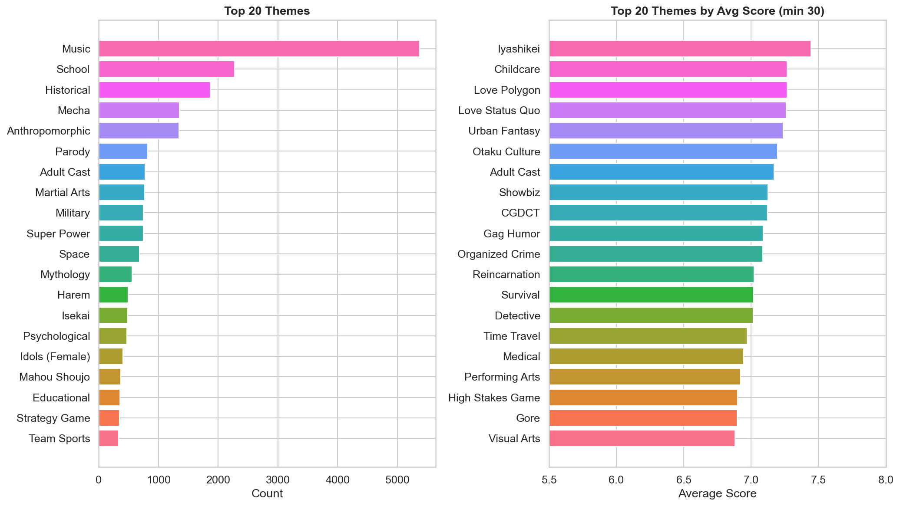
*Figure 20: Left — Top 20 themes by count. Right — Top 20 themes by mean score (minimum 30 entries).*

### 14.1 Theme Frequency

The most common thematic tags reflect anime's core storytelling pillars:

1. **Music** (5,400+) — Unexpectedly dominant, inflated by music video entries
2. **School** (2,400+) — The quintessential anime setting
3. **Historical** (1,700+) — Period dramas and war narratives
4. **Mecha** (1,300+) — Giant robots, a defining anime genre

### 14.2 Theme Quality

The highest-rated themes tell a different story:

1. **Iyashikei** (7.45) — "Healing" anime; slow-paced, atmospheric comfort shows
2. **Childcare** (7.38) — Parenting/family narratives
3. **Love Polygon** (7.32) — Complex romantic structures

**Iyashikei** topping the quality rankings is a significant finding — this niche genre, characterized by gentle pacing and emotional warmth, consistently delivers high viewer satisfaction despite minimal mainstream visibility. This has implications for recommendation systems: users seeking high-satisfaction viewing should be directed toward iyashikei titles, even if they don't match typical action-oriented preferences.

---

## 15. Correlation Structure

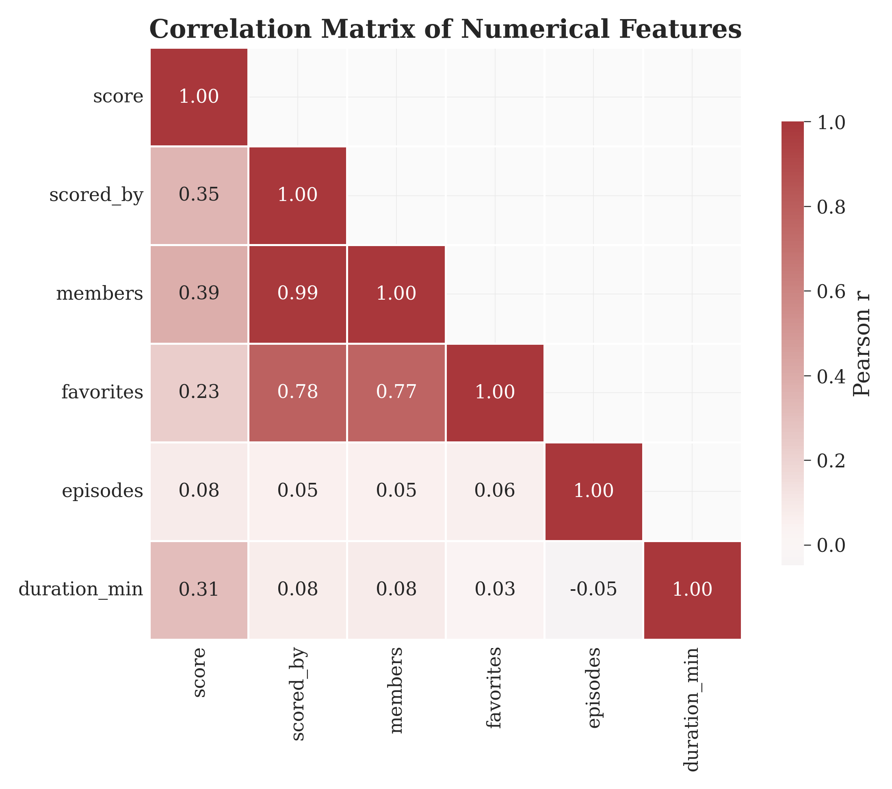
*Figure 21: Pearson correlation matrix of numerical features.*

The correlation matrix reveals the dataset's metric structure:

- **members ↔ scored_by ↔ favorites** form a tightly correlated triad (r > 0.85), effectively measuring the same latent construct: community engagement
- **score** correlates moderately with all engagement metrics (r ≈ 0.55–0.67), confirming the popularity-quality link
- **episodes** and **duration** show weak correlations with other metrics, suggesting format length is largely independent of quality or popularity
- **episodes ↔ duration** correlation is low, because MAL reports per-episode duration rather than total runtime

---

## 16. Key Findings and Discussion

### 16.1 Summary of Findings

1. **Score compression:** The effective scoring range is narrow (IQR = 1.25 points), making even small score differences meaningful. An anime at 7.5 is genuinely in the top tier.

2. **Production explosion:** Anime output grew ~27× from the 1960s (397) to the 2010s (10,847), driven by digital production, streaming distribution, and the ONA format.

3. **Format matters:** TV series score highest on average (6.83), likely due to selection effects and greater audience investment. The 2-cour (14–26 episode) format achieves the optimal quality sweet spot.

4. **Adaptation premium:** Adapted works (manga, light novel, web novel) systematically outperform originals, because adaptation serves as a quality filter.

5. **Studio consistency:** Kyoto Animation achieves the remarkable combination of high volume (132 titles) and high quality (7.36 mean), suggesting institutional excellence rather than individual hits.

6. **Genre paradox:** The most popular genres (Comedy, Fantasy, Action) are not the highest rated. Quality concentrates in niche genres (Award Winning, Suspense, Mystery) and niche themes (Iyashikei, Childcare).

7. **Discovery gap:** Chinese donghua titles are systematically underrepresented in community attention despite achieving high scores, representing the largest opportunity for recommendation system improvement.

### 16.2 Limitations

- **Survivorship bias:** Older titles that are poorly rated receive fewer ratings and may not appear in the top anime endpoint at all.
- **Self-selection in scoring:** Only users who choose to rate contribute to scores, introducing engagement bias.
- **Franchise inflation:** Sequel seasons inherit self-selected audiences, inflating top rankings.
- **Western bias:** MAL's user base skews Western; Japanese domestic reception may differ significantly.
- **Temporal snapshot:** This data represents a single point in time; scores evolve as community composition changes.

### 16.3 Recommendations

For **recommendation systems:** Incorporate popularity-adjusted scoring to surface hidden gems. Weight iyashikei and donghua titles higher for users who rate literary/artistic anime highly.

For **industry analysts:** The 2-cour format and manga/light novel adaptations represent the most reliable formula for critical success. Studios should note that quality consistency (à la Kyoto Animation) builds lasting brand value.

For **future research:** Longitudinal analysis of score evolution over time, network analysis of genre co-occurrences, and sentiment analysis of synopsis text could deepen these findings.

---

## 17. Technical Appendix

### 17.1 Tools and Libraries

| Tool | Version | Purpose |
|------|---------|---------|
| Python | 3.11+ | Primary language |
| pandas | 2.x | Data manipulation |
| matplotlib | 3.x | Base plotting |
| seaborn | 0.13+ | Statistical visualization |
| scipy | 1.x | Statistical testing |
| BeautifulSoup4 | 4.x | HTML parsing (scraper) |
| requests | 2.x | HTTP client |
| wordcloud | 1.9+ | Text visualization |
| sqlite3 | stdlib | Database storage |

### 17.2 Reproducibility

All code is available in the repository:

- `mal_jikan_scraper.py` — Data collection via Jikan API
- `mal_scraper.py` — Alternative direct HTML scraper
- `data.ipynb` — Complete analysis pipeline generating all figures

```bash
# Reproduce the analysis
pip install pandas matplotlib seaborn wordcloud scipy
python mal_jikan_scraper.py    # ~1 hour for full scrape
python data.ipynb         # ~30 seconds for all figures
```

### 17.3 Data Availability

- **Raw data:** `mal_top_anime.csv` (29,786 × 24)
- **Database:** `mal_top_anime.db` (SQLite, indexed)
- **Figures:** `figures/` directory (23 publication-quality PNGs at 300 DPI)
- **Interactive report:** `figures/report.html`

---

*Analysis conducted February 2026. Data sourced from MyAnimeList via Jikan API v4.*
*All figures generated at 300 DPI for publication use.*
*Made by Eeman Majumder*
